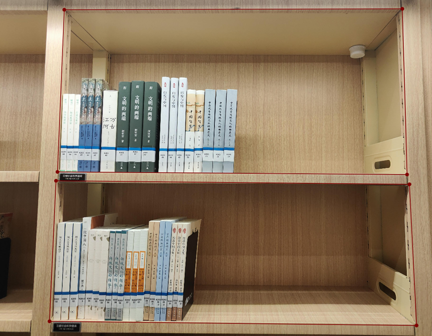
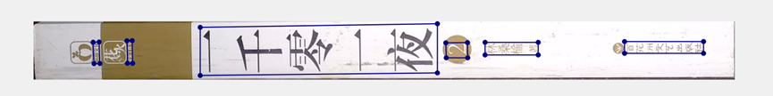
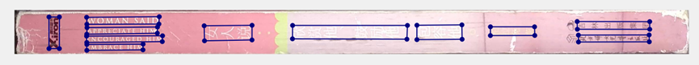

# 一. 打标工具
    a. labelme 
[labelme的安装使用教程](https://blog.csdn.net/weixin_43427721/article/details/107122775) 

    b. PPOCRLabel
[对应的安装使用教程](https://github.com/PaddlePaddle/PaddleOCR/blob/release/2.0/PPOCRLabel/README_ch.md)

# 二. 拍摄要求
        画质清晰，可以人眼辨别书脊上的文字

# 三. 打标任务及要求 
   a. 层架定位打标（推荐：labelme） 
   
    要求： 所画的四边形(或多边形)尽量贴近层架的边缘， 打标效果示例如下： 
  
   b. 书脊定位打标（推荐：labelme）  
     要求：所画的四边形(或多边形)尽量贴近每一本书脊的边缘（考虑到有些书本间隙过小，各边可以适当向内收缩几个像素）
     
           注： 所有的图像尽可能的没有水印(这是个反向案例)    
          
   c. 文字定位打标（推荐：PPOCRLabel，这样就可以与接下来的任务“文字识别打标”一块做了） 

   要求：多画的四边形（或多边形）可能的贴近文本块的边缘，书脊上可见的文字都要无遗漏的标注出来
   
    

   d. 文字识别打标（推荐：PPOCRLabel）
     要求：准确的图像块中的文字与录入的文字相一致 (注意空格也要录入)
        
      需要录入的文字为： EMBRACE HIM
   