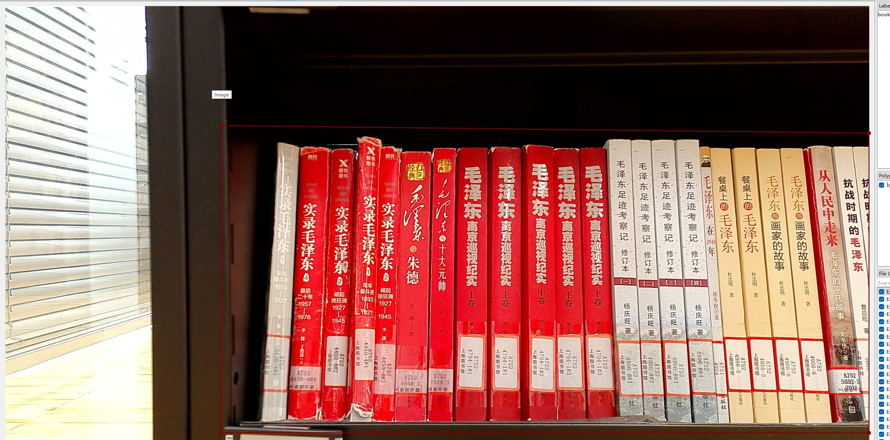
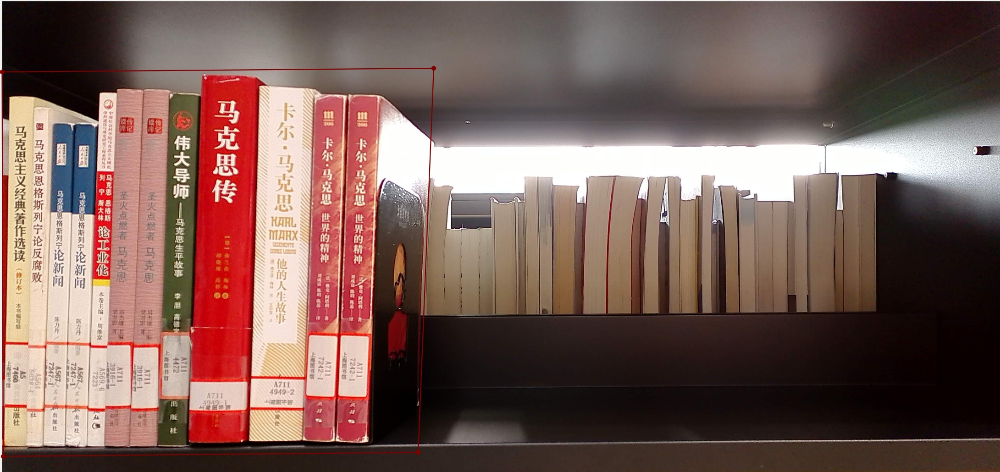
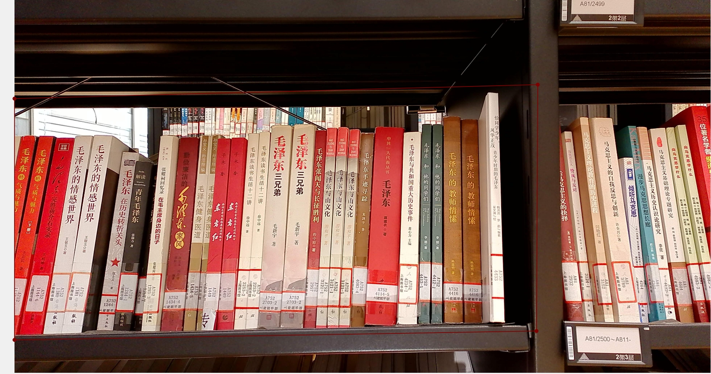
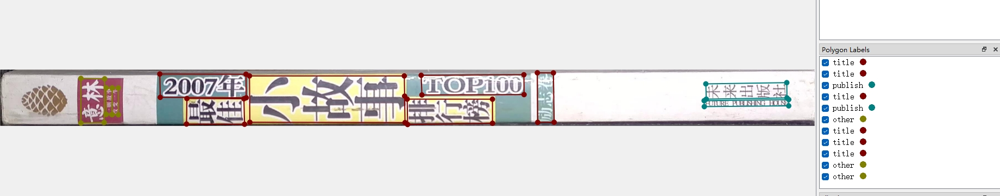
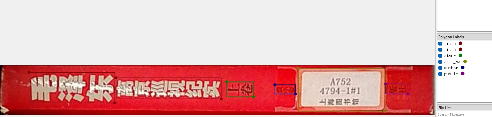

# 一. 打标工具
    a. labelme 
[labelme的安装使用教程](https://blog.csdn.net/weixin_43427721/article/details/107122775) 

<del>    b. PPOCRLabel~
[对应的安装使用教程](https://github.com/PaddlePaddle/PaddleOCR/blob/release/2.0/PPOCRLabel/README_ch.md)
</del>

# 二. 拍摄要求
        画质清晰，可以人眼辨别书脊上的文字

# 三. 打标任务及要求 
   a. 层架定位打标（推荐：labelme）, 对应的标签为 "bookszone"  
   示例文件位置：examples\层架定位  
    1. 左侧层架打标要求： 所画的四边形(或多边形)   
       -- 左边+下边 边缘靠近层架边缘，  
       -- 上边+右边 边缘靠近本层书边缘，  
        打标效果示例如下： 
  

    2. 中间层架打标要求： 所画的四边形(或多边形) 
       -- 左边+上边+右边边缘靠近本层书边缘，
       -- 下边缘靠近层架边缘
        打标效果示例如下： 

    3. 右侧层架打标要求： 所画的四边形(或多边形) 
       -- 左边+上边 边缘靠近本层书边缘，
       -- 下边+右边 边缘靠近层架边缘，
        打标效果示例如下 

   b. 书脊定位打标（推荐：labelme）, 对应的标签为 "bookspine"   
   示例文件位置：examples\书脊定位  
     要求：所画的四边形(或多边形)尽量贴近每一本书脊的边缘（考虑到有些书本间隙过小，各边可以适当向内收缩几个像素）  
     
           注： 所有的图像尽可能的没有水印(这是个反向案例)    
     
    c. 书脊文字定位与分类 打标（推荐：labelme）
    示例文件位置：examples\书脊文字定位+分类
    要求：多画的四边形（或多边形）可能的贴近文本块的边缘，书脊上可见的文字都要无遗漏的标注出来，其标签为下面5种标签, 具体可参考 corpus/2025.01.20V2(1).xlsx  
        a. 系列名区域 ====> "series"  
        b. 书名区域  ======> "title"  
        c. 作者区域  ======> "author"  
        d. 出版社区域 =====> "public"  
        e. 索书号区域 =====> "call_no"  
        f. 条形码区域 ======> "barcode"  
        g. 其他区域 =======> "other"  

    
   <!-- c. 文字定位打标（推荐：PPOCRLabel，这样就可以与接下来的任务“文字识别打标”一块做了） 

   要求：多画的四边形（或多边形）可能的贴近文本块的边缘，书脊上可见的文字都要无遗漏的标注出来
   
    

   d. 文字识别打标（推荐：PPOCRLabel）
     要求：准确的图像块中的文字与录入的文字相一致 (注意空格也要录入)
        
      需要录入的文字为： EMBRACE HIM -->
   